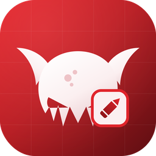
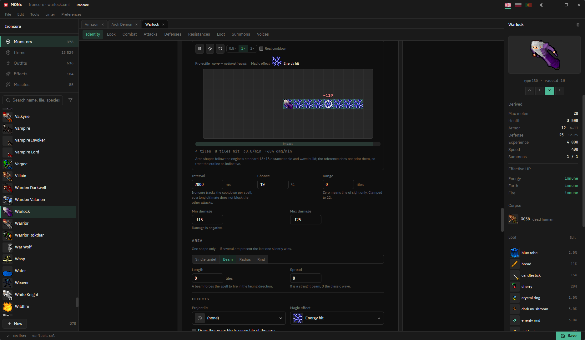

<div align="center">



# MONx

[](https://github.com/Coldensjo/MONx/stargazers)
[](LICENSE)
[](https://github.com/sponsors/Coldensjo)



</div>

A monster editor for OpenTibia servers — Ironcore, TheForgottenServer, TheVioletProject, Nostalrius, Canary/OTServBR, CrystalServer and BlackTek. Open a workspace, pick a monster, edit, save.

A workspace is up to four folders: the server's `monster/` folder, its `items/` folder, a client folder and optionally `spells/`. **Only the monsters folder is required** — the rest fill in what they can. Outfits, corpses and loot render as real sprites because the client assets are loaded alongside the monsters, from either a `.spr`/`.dat` pair or a modern 12.x+ asset bundle.

Built with Tauri 2 (Rust) and React 18 + TypeScript + Vite.

## Prerequisites

- **Rust** (stable) — via [rustup](https://rustup.rs)
- **Bun** 1.3+ — via [bun.sh](https://bun.sh) (the repo pins `bun@1.3.14`)

**Arch Linux**

```sh
sudo pacman -S --needed base-devel webkit2gtk-4.1 curl wget file openssl \
  gtk3 libappindicator-gtk3 librsvg
```

**Ubuntu 22.04+ / Debian** (older releases ship only webkit2gtk 4.0, which Tauri 2 does not support)

```sh
sudo apt install libwebkit2gtk-4.1-dev build-essential curl wget file \
  libxdo-dev libssl-dev libayatana-appindicator3-dev librsvg2-dev
```

## Development

```sh
bun install
bun run tauri:dev
```

On Linux use `./monx.sh` instead — same thing, but through XWayland with WebKitGTK's dmabuf renderer disabled, which otherwise crashes the webview under Wayland ("Error 71 Protocol error").

## Release builds

On Windows:

```sh
bun run tauri:build:portable   # portable .exe only
bun run tauri:build            # NSIS installer only
bun run tauri:build:all        # both
```

- Portable: `src-tauri/target/release/monx-portable.exe`
- Installer: `src-tauri/target/release/bundle/nsis/`

The bundle target in `tauri.conf.json` is Windows NSIS, so on Linux build the plain binary instead:

```sh
bun run build                      # frontend into dist/
cd src-tauri && cargo build --release
```

It lands at `src-tauri/target/release/monx`. Build the frontend first — the release binary embeds `dist/` at compile time, so a stale `dist/` ships stale UI. Under Wayland, launch it the same way `monx.sh` does:

```sh
GDK_BACKEND=x11 WEBKIT_DISABLE_DMABUF_RENDERER=1 ./src-tauri/target/release/monx
```

## Verifying changes

- Frontend: `bun run build` (runs `tsc`, then Vite)
- Backend compile: `cargo check` in `src-tauri/`
- Backend behaviour: from `src-tauri/`, `cargo run --example probe_monster -- <monsters-dir>` reads and rewrites the whole corpus and diffs the bytes. `probe_dat`, `probe_assets` and `probe_lua` do the same for sprite composition and the Lua document layer. AGENTS.md lists the flags.

## Further reading

- [AGENTS.md](AGENTS.md) — architecture, conventions, directory map
- [ENGINES.md](ENGINES.md) — how the seven servers differ, and the profile system that models it
- [CONTRIBUTING.md](CONTRIBUTING.md) — how to get set up and send a change

## Credits

MONx is a fork of SPRx, a sprite browser for the same client formats, and
inherits its sprite/thing engine — `spr.rs`, `dat.rs`, the protocol image
server and the virtualized browsers. SPRx in turn took part of its `.spr`
parser from [Sprite Forge](https://github.com/Frenvius/sprite-forge) by
Frenvius, which is MIT-licensed; that notice is retained in
[LICENSE](LICENSE).

## Legal

MONx is an unofficial, fan-made tool. It is not affiliated with, endorsed by,
or sponsored by CipSoft GmbH. Tibia is a registered trademark of CipSoft GmbH.

MONx ships no game data. It reads the client and server files you already have
— no client assets, item databases or monster files are distributed with it.

## Sponsor

MONx is free and MIT-licensed. If it saves you time, you can support the work through [GitHub Sponsors](https://github.com/sponsors/Coldensjo).